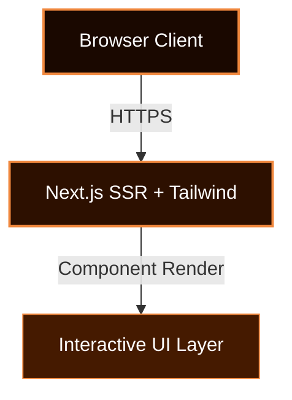

<div align="center">

![Header](data:image/svg+xml;base64,PHN2ZyB3aWR0aD0iODAwIiBoZWlnaHQ9IjIwMCIgdmlld0JveD0iMCAwIDgwMCAyMDAiIHhtbG5zPSJodHRwOi8vd3d3LnczLm9yZy8yMDAwL3N2ZyI+CiAgPGRlZnM+CiAgICA8bGluZWFyR3JhZGllbnQgaWQ9ImJnIiB4MT0iMCUiIHkxPSIwJSIgeDI9IjEwMCUiIHkyPSIxMDAlIj4KICAgICAgPHN0b3Agb2Zmc2V0PSIwJSIgc3RvcC1jb2xvcj0iIzFhMDgwMCIvPgogICAgICA8c3RvcCBvZmZzZXQ9IjUwJSIgc3RvcC1jb2xvcj0iIzJkMTAwMCIvPgogICAgICA8c3RvcCBvZmZzZXQ9IjEwMCUiIHN0b3AtY29sb3I9IiM0NTFhMDAiLz4KICAgIDwvbGluZWFyR3JhZGllbnQ+CiAgICA8ZmlsdGVyIGlkPSJnbG93Ij4KICAgICAgPGZlR2F1c3NpYW5CbHVyIHN0ZERldmlhdGlvbj0iNCIgcmVzdWx0PSJiIi8+CiAgICAgIDxmZUNvbXBvc2l0ZSBpbj0iU291cmNlR3JhcGhpYyIgaW4yPSJiIiBvcGVyYXRvcj0ib3ZlciIvPgogICAgPC9maWx0ZXI+CiAgICA8ZmlsdGVyIGlkPSJnbG93MiI+CiAgICAgIDxmZUdhdXNzaWFuQmx1ciBzdGREZXZpYXRpb249IjgiIHJlc3VsdD0iYiIvPgogICAgICA8ZmVDb21wb3NpdGUgaW49IlNvdXJjZUdyYXBoaWMiIGluMj0iYiIgb3BlcmF0b3I9Im92ZXIiLz4KICAgIDwvZmlsdGVyPgogIDwvZGVmcz4KICA8cmVjdCB3aWR0aD0iMTAwJSIgaGVpZ2h0PSIxMDAlIiBmaWxsPSJ1cmwoI2JnKSIgcng9IjEyIi8+CiAgCiAgPCEtLSBHcmlkIGxpbmVzIC0tPgogIDxsaW5lIHgxPSIwIiB5MT0iNTAiIHgyPSI4MDAiIHkyPSI1MCIgc3Ryb2tlPSIjZjA4ODNlIiBvcGFjaXR5PSIwLjA1IiBzdHJva2Utd2lkdGg9IjEiLz4KICA8bGluZSB4MT0iMCIgeTE9IjEwMCIgeDI9IjgwMCIgeTI9IjEwMCIgc3Ryb2tlPSIjZjA4ODNlIiBvcGFjaXR5PSIwLjA1IiBzdHJva2Utd2lkdGg9IjEiLz4KICA8bGluZSB4MT0iMCIgeTE9IjE1MCIgeDI9IjgwMCIgeTI9IjE1MCIgc3Ryb2tlPSIjZjA4ODNlIiBvcGFjaXR5PSIwLjA1IiBzdHJva2Utd2lkdGg9IjEiLz4KICA8bGluZSB4MT0iMjAwIiB5MT0iMCIgeDI9IjIwMCIgeTI9IjIwMCIgc3Ryb2tlPSIjZjA4ODNlIiBvcGFjaXR5PSIwLjA1IiBzdHJva2Utd2lkdGg9IjEiLz4KICA8bGluZSB4MT0iNDAwIiB5MT0iMCIgeDI9IjQwMCIgeTI9IjIwMCIgc3Ryb2tlPSIjZjA4ODNlIiBvcGFjaXR5PSIwLjA1IiBzdHJva2Utd2lkdGg9IjEiLz4KICA8bGluZSB4MT0iNjAwIiB5MT0iMCIgeDI9IjYwMCIgeTI9IjIwMCIgc3Ryb2tlPSIjZjA4ODNlIiBvcGFjaXR5PSIwLjA1IiBzdHJva2Utd2lkdGg9IjEiLz4KICAKICAKICA8Y2lyY2xlIGN4PSI1MDAiIGN5PSIzMCIgcj0iMiIgZmlsbD0iI2YwODgzZSIgb3BhY2l0eT0iMC42Ij4KICAgIDxhbmltYXRlIGF0dHJpYnV0ZU5hbWU9ImN4IiB2YWx1ZXM9IjUwMDsgMzAwOyA1MDAiIGR1cj0iNnMiIHJlcGVhdENvdW50PSJpbmRlZmluaXRlIiAvPgogICAgPGFuaW1hdGUgYXR0cmlidXRlTmFtZT0ib3BhY2l0eSIgdmFsdWVzPSIwLjM7IDAuOTsgMC4zIiBkdXI9IjdzIiByZXBlYXRDb3VudD0iaW5kZWZpbml0ZSIgLz4KICA8L2NpcmNsZT4KICA8Y2lyY2xlIGN4PSIzNDAiIGN5PSI1NSIgcj0iMyIgZmlsbD0iI2YwODgzZSIgb3BhY2l0eT0iMC42Ij4KICAgIDxhbmltYXRlIGF0dHJpYnV0ZU5hbWU9ImN4IiB2YWx1ZXM9IjM0MDsgNDYwOyAzNDAiIGR1cj0iNnMiIHJlcGVhdENvdW50PSJpbmRlZmluaXRlIiAvPgogICAgPGFuaW1hdGUgYXR0cmlidXRlTmFtZT0ib3BhY2l0eSIgdmFsdWVzPSIwLjM7IDAuOTsgMC4zIiBkdXI9IjdzIiByZXBlYXRDb3VudD0iaW5kZWZpbml0ZSIgLz4KICA8L2NpcmNsZT4KICA8Y2lyY2xlIGN4PSI0NjAiIGN5PSI4MCIgcj0iNCIgZmlsbD0iI2YwODgzZSIgb3BhY2l0eT0iMC42Ij4KICAgIDxhbmltYXRlIGF0dHJpYnV0ZU5hbWU9ImN4IiB2YWx1ZXM9IjQ2MDsgMzQwOyA0NjAiIGR1cj0iNnMiIHJlcGVhdENvdW50PSJpbmRlZmluaXRlIiAvPgogICAgPGFuaW1hdGUgYXR0cmlidXRlTmFtZT0ib3BhY2l0eSIgdmFsdWVzPSIwLjM7IDAuOTsgMC4zIiBkdXI9IjdzIiByZXBlYXRDb3VudD0iaW5kZWZpbml0ZSIgLz4KICA8L2NpcmNsZT4KICA8Y2lyY2xlIGN4PSI2NjAiIGN5PSIxMDUiIHI9IjIiIGZpbGw9IiNmMDg4M2UiIG9wYWNpdHk9IjAuNiI+CiAgICA8YW5pbWF0ZSBhdHRyaWJ1dGVOYW1lPSJjeCIgdmFsdWVzPSI2NjA7IDE0MDsgNjYwIiBkdXI9IjVzIiByZXBlYXRDb3VudD0iaW5kZWZpbml0ZSIgLz4KICAgIDxhbmltYXRlIGF0dHJpYnV0ZU5hbWU9Im9wYWNpdHkiIHZhbHVlcz0iMC4zOyAwLjk7IDAuMyIgZHVyPSI2cyIgcmVwZWF0Q291bnQ9ImluZGVmaW5pdGUiIC8+CiAgPC9jaXJjbGU+CiAgPGNpcmNsZSBjeD0iNzAwIiBjeT0iMTMwIiByPSIzIiBmaWxsPSIjZjA4ODNlIiBvcGFjaXR5PSIwLjYiPgogICAgPGFuaW1hdGUgYXR0cmlidXRlTmFtZT0iY3giIHZhbHVlcz0iNzAwOyAxMDA7IDcwMCIgZHVyPSI1cyIgcmVwZWF0Q291bnQ9ImluZGVmaW5pdGUiIC8+CiAgICA8YW5pbWF0ZSBhdHRyaWJ1dGVOYW1lPSJvcGFjaXR5IiB2YWx1ZXM9IjAuMzsgMC45OyAwLjMiIGR1cj0iNnMiIHJlcGVhdENvdW50PSJpbmRlZmluaXRlIiAvPgogIDwvY2lyY2xlPgogIDxjaXJjbGUgY3g9IjM0MCIgY3k9IjE1NSIgcj0iNCIgZmlsbD0iI2YwODgzZSIgb3BhY2l0eT0iMC42Ij4KICAgIDxhbmltYXRlIGF0dHJpYnV0ZU5hbWU9ImN4IiB2YWx1ZXM9IjM0MDsgNDYwOyAzNDAiIGR1cj0iNnMiIHJlcGVhdENvdW50PSJpbmRlZmluaXRlIiAvPgogICAgPGFuaW1hdGUgYXR0cmlidXRlTmFtZT0ib3BhY2l0eSIgdmFsdWVzPSIwLjM7IDAuOTsgMC4zIiBkdXI9IjdzIiByZXBlYXRDb3VudD0iaW5kZWZpbml0ZSIgLz4KICA8L2NpcmNsZT4KICAKICA8IS0tIFNjYW5uaW5nIGxpbmUgLS0+CiAgPHJlY3QgeD0iMCIgeT0iMCIgd2lkdGg9IjgwMCIgaGVpZ2h0PSIzIiBmaWxsPSIjZjA4ODNlIiBvcGFjaXR5PSIwLjMiPgogICAgPGFuaW1hdGUgYXR0cmlidXRlTmFtZT0ieSIgdmFsdWVzPSIwOyAyMDA7IDAiIGR1cj0iNnMiIHJlcGVhdENvdW50PSJpbmRlZmluaXRlIi8+CiAgPC9yZWN0PgogIAogIDx0ZXh0IHg9IjUwJSIgeT0iNDIlIiBmb250LWZhbWlseT0iQXJpYWwsc2Fucy1zZXJpZiIgZm9udC13ZWlnaHQ9ImJvbGQiIGZvbnQtc2l6ZT0iMzgiIGZpbGw9IiNmMDg4M2UiIHRleHQtYW5jaG9yPSJtaWRkbGUiIGZpbHRlcj0idXJsKCNnbG93KSIgc3R5bGU9ImxldHRlci1zcGFjaW5nOjRweCI+CiAgICBORVVSTyBNSVJST1IgQUkKICA8L3RleHQ+CiAgPHRleHQgeD0iNTAlIiB5PSI2MiUiIGZvbnQtZmFtaWx5PSJBcmlhbCxzYW5zLXNlcmlmIiBmb250LXNpemU9IjEzIiBmaWxsPSIjZmZhYjcwIiB0ZXh0LWFuY2hvcj0ibWlkZGxlIiBzdHlsZT0ibGV0dGVyLXNwYWNpbmc6M3B4O29wYWNpdHk6MC44Ij4KICAgIFBST1BSSUVUQVJZIFRZUEVTQ1JJUFQgQVJDSElURUNUVVJFCiAgPC90ZXh0PgogIAogIDwhLS0gQm90dG9tIGFjY2VudCBsaW5lIC0tPgogIDxsaW5lIHgxPSIyNTAiIHkxPSIxNzUiIHgyPSI1NTAiIHkyPSIxNzUiIHN0cm9rZT0iI2YwODgzZSIgc3Ryb2tlLXdpZHRoPSIyIiBmaWx0ZXI9InVybCgjZ2xvdykiPgogICAgPGFuaW1hdGUgYXR0cmlidXRlTmFtZT0ieDEiIHZhbHVlcz0iMjUwOzMwMDsyNTAiIGR1cj0iM3MiIHJlcGVhdENvdW50PSJpbmRlZmluaXRlIi8+CiAgICA8YW5pbWF0ZSBhdHRyaWJ1dGVOYW1lPSJ4MiIgdmFsdWVzPSI1NTA7NTAwOzU1MCIgZHVyPSIzcyIgcmVwZWF0Q291bnQ9ImluZGVmaW5pdGUiLz4KICA8L2xpbmU+Cjwvc3ZnPg==)

<br/>

<p align="center">
  
  
  
  
</p>

  
  
  
  

<br/>


</div>

---

## Overview

> A proprietary web application system comprising 37 integrated source modules.

**neuro mirror ai** is an advanced web application system engineered by **Karthik Idikuda**. Built with TypeScript, React, Next.js, TailwindCSS.

<br/>

## System Architecture



<br/>

## Project Structure

```
neuro-mirror-ai/
  .gitignore
  LICENSE
  README.md
  eslint.config.mjs
  next.config.ts
  package-lock.json
  package.json
  postcss.config.mjs
  public/
    file.svg
    globe.svg
    next.svg
    vercel.svg
  src/
```

<br/>

## Technical Specifications

| Attribute | Detail |
|:---|:---|
| **Primary Language** | `TypeScript` |
| **Project Category** | `Web Application` |
| **Total Source Files** | `37` |
| **Frameworks** | `TypeScript`, `React`, `Next.js`, `TailwindCSS` |
| **IP Status** | `Strictly Proprietary` |

## Dependencies

<p align="left">
  <code>eslint-config-next</code>  <code>three</code>  <code>next</code>  <code>gsap</code>  <code>@types/react-dom</code>  <code>react</code>  <code>eslint</code>  <code>@mediapipe/pose</code>  <code>react-dom</code>  <code>@tailwindcss/postcss</code>  <code>@react-three/drei</code>  <code>@types/node</code>  <code>@types/react</code>  <code>@mediapipe/camera_utils</code>  <code>framer-motion</code>
</p>


## STRICT LEGAL WARNING

> **PROPRIETARY AND CONFIDENTIAL**

This software is the **exclusive property of Karthik Idikuda**.

- **NO PERMISSION** to use, copy, modify, or distribute without written consent.
- **UNAUTHORIZED USE** results in litigation, financial penalties, and criminal prosecution.
- **LICENSING:** Contact Karthik Idikuda directly to negotiate terms.

*By viewing this repository, you accept these proprietary terms.*

---

<div align="center">
  <br/>
  
</div>

<!-- WATERMARK: S0ktUFJPUFJJRVRBUlktbmV1cm8tbWlycm9yLWFpLTIwMjY= -->
